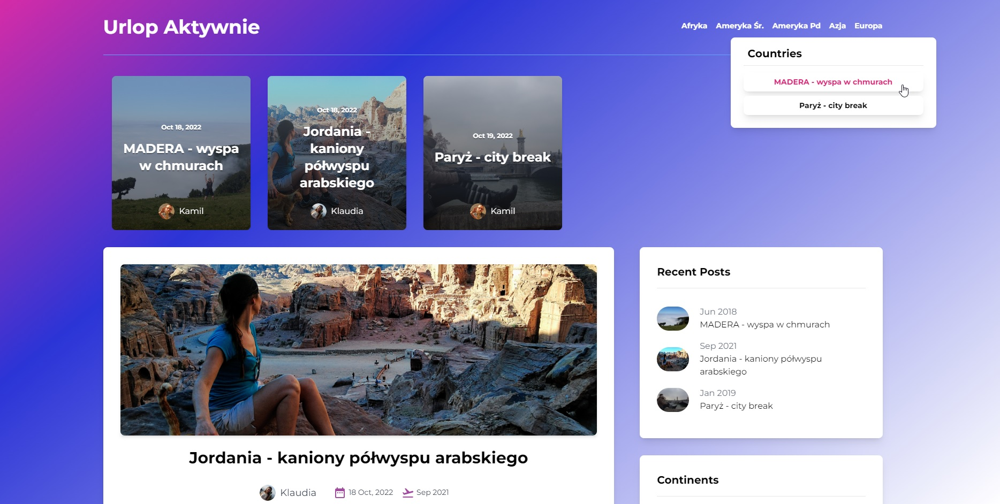
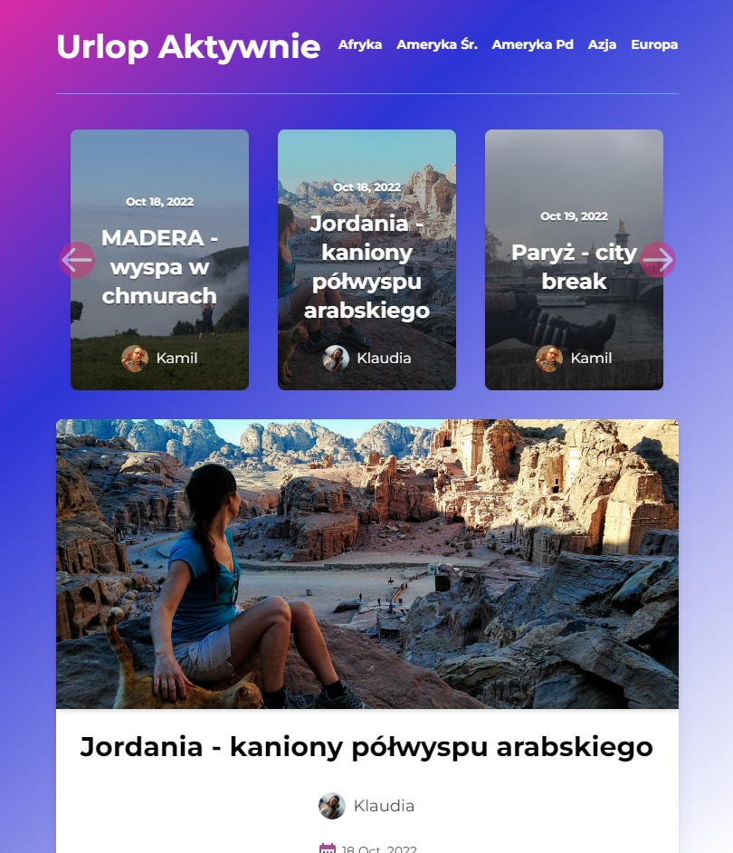

# Our Travel Blog

> Site available here:
> [_here_](https://urlopaktywnie.pl/).

## Table of Contents

- [General Info](#general-information)
- [Technologies Used](#technologies-used)
- [Features](#features)
- [Screenshots](#screenshots)
- [Setup](#setup)
- [Usage](#usage)
- [Project Status](#project-status)
- [Room for Improvement](#room-for-improvement)
- [Contact](#contact)
<!-- * [License](#license) -->

## General Information

- In order to share with people your experiences from different places on earth, you need that place.
<!-- - What problem does it (intend to) solve?
- What is the purpose of your project?
- Why did you undertake it? -->

## Technologies Used

- React.js - version 18.2.0
- Graphql - version 16.6.0
- NextJs - version 12.3.1
- Sass - version 1.55
- Tailwind CSS - version 3.1.8
- JavaScript
- Stripe - 10.15.0
- CSS3

## Features

<!-- List the ready features here: -->

- possibility to manage posts using GraphCMS (create, edit, remove)
- sort post by
- easy navigate throught pages
- mobile optimization
- posibility to buy coffee for post author

## Screenshots

<!--  -->

## Project Status

Project is: _in progress_

<!-- / _complete_ / _no longer being worked on_. If you are no longer working on it, provide reasons why. -->

## Room for Improvement

<!-- Include areas you believe need improvement / could be improved. Also add TODOs for future development. -->

Room for improvement:

- some visual aspects

## Contact

Created by [@kamilkasiak] - feel free to contact me!
